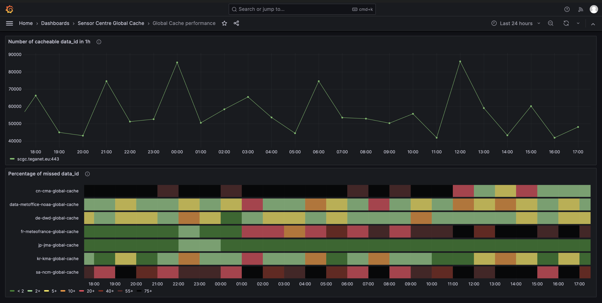

# Sensor Centre Global Cache (SCGC) Tutorials

## Deploy the Sensor Centre Global Cache

Run an instance of the Sensor Centre Global Cache on your `{name}.champion.wis2dev.io` instance.

### Pre-requisites

- [ ] Prometheus container deployed on your VM and running on the traefik network
- [ ] Grafana container deployed on your VM and running on the traefik network
- [ ] Redis container deployed on your VM and running on traefik network
- [ ] Grafana configured with Prometheus as a target

---

### Docker Compose for Prometheus

`[YOUR_PATH]/docker/compose/prometheus.yml`

```yaml
services:
  prometheus:
    networks:
      - traefik
    container_name: prometheus
    image: prom/prometheus:v3.10.0
    volumes:
      - [YOUR_PATH]/docker/prometheus:/etc/prometheus
      - [YOUR_PATH]/docker/prometheus/prometheus-data:/prometheus
    command:
      - '--config.file=/etc/prometheus/prometheus.yml'
      - '--storage.tsdb.path=/prometheus'
      - '--web.console.libraries=/usr/share/prometheus/console_libraries'
      - '--web.console.templates=/usr/share/prometheus/consoles'
      - '--web.enable-lifecycle'
      - '--web.enable-admin-api'
      - '--web.external-url=https://[YOUR_NAME].champion.wis2dev.io/prometheus'
      - '--web.route-prefix=/prometheus'
    restart: unless-stopped
    labels:
      traefik.enable: true
      traefik.http.routers.prometheus.entrypoints: websecure
      traefik.http.routers.prometheus.rule: Host(`[YOUR_NAME].champion.wis2dev.io`) && PathPrefix(`/prometheus`)
      traefik.http.services.prometheus.loadbalancer.server.port: 9090
      traefik.http.services.prometheus.loadbalancer.server.scheme: http
      traefik.http.routers.prometheus.tls: true
      traefik.http.routers.prometheus.middlewares: auth@file

networks:
  traefik:
    external: true
```

---

### Docker Compose for Grafana

`[YOUR_PATH]/docker/compose/grafana.yml`

```yaml
services:
  grafana:
    networks:
      - traefik
    container_name: grafana
    image: grafana/grafana:12.3
    volumes:
      - [YOUR_PATH]/docker/grafana:/var/lib/grafana
    restart: unless-stopped
    environment:
      - GF_SERVER_ROOT_URL=https://[YOUR_NAME].champion.wis2dev.io/grafana
      - GF_SERVER_SERVE_FROM_SUB_PATH=true
      # - GF_AUTH_DISABLE_LOGIN_FORM=true
    user: 1001:1003
    labels:
      traefik.enable: true
      traefik.http.routers.grafana.entrypoints: websecure
      traefik.http.routers.grafana.rule: Host(`[YOUR_NAME].champion.wis2dev.io`) && PathPrefix(`/grafana`)
      traefik.http.services.grafana.loadbalancer.server.port: 3000
      traefik.http.services.grafana.loadbalancer.server.scheme: http
      traefik.http.routers.grafana.tls: true
networks:
  traefik:
    external: true
```

> Check that the UID and GID are correct for your user.

---

### Docker Compose for Redis

`[YOUR_PATH]/docker/compose/redis.yml`

```yaml
services:
  redis:
    container_name: redis
    image: redis:8.2.2
    networks:
      - traefik
    command: redis-server --save "" --appendonly no
    restart: unless-stopped
networks:
   traefik:
      external: true
```

> Does this need `command: --port 6379`? No, 6379 is the default.

---

### Traefik Configuration

Nothing to add to `traefik.yml`; Redis is not exposed externally. Prometheus and Grafana are configured to use `web` (port 80) and `websecure` (port 443) for external access.

---

### Run the Redis Container

```bash
docker compose -f redis.yml up -d
```

---

### Configure New Prometheus Target in Grafana

Using the Grafana web application, add a new Prometheus connection:

**Connection → Add data source → Prometheus**

Configure the Prometheus service URL:

```
http://prometheus:9090/prometheus
```

> `http` because the service is internal on the traefik network; `/prometheus` because this was the `PathPrefix` used in the Prometheus docker compose.

---

### Deploy Sensor Centre Global Cache Container

`[YOUR_PATH]/docker/compose/scgc.yml`

```yaml
services:
  sensorglobalcache:
    container_name: scgc
    image: golfvert/scgc:1.4.8
    environment:
      - TZ=Europe/Paris
      - MQTT_GB1_BROKER=mqtts://globalbroker.meteo.fr:8883
      - MQTT_GB1_USERNAME=everyone
      - MQTT_GB1_PASSWORD=everyone
      - GB1_ID=fr-meteofrance-globalbroker
      - MQTT_GB2_BROKER=mqtts://globalbroker.inmet.gov.br:8883
      - MQTT_GB2_USERNAME=everyone
      - MQTT_GB2_PASSWORD=everyone
      - GB2_ID=br-inmet-globalbroker
      - MQTT_TOPIC=#
      - MQTT_GC_1_BROKER=mqtts://wis2.dwd.de:8883
      - MQTT_GC_1_USERNAME=everyone
      - MQTT_GC_1_PASSWORD=everyone
      - GC_1_ID=de-dwd-global-cache
      - MQTT_GC_2_BROKER=mqtts://mqtt.wis-jma.go.jp
      - MQTT_GC_2_USERNAME=france
      - MQTT_GC_2_PASSWORD=juz*ai~v0eiNieT8bi
      - GC_2_ID=jp-jma-global-cache
      - MQTT_GC_3_BROKER=mqtts://wis2gc.kma.go.kr:8883
      - MQTT_GC_3_USERNAME=everyone
      - MQTT_GC_3_PASSWORD=everyone
      - GC_3_ID=kr-kma-global-cache
      - MQTT_GC_4_BROKER=mqtts://wis2.ncm.gov.sa:8883
      - MQTT_GC_4_USERNAME=everyone
      - MQTT_GC_4_PASSWORD=everyone
      - GC_4_ID=sa-ncm-global-cache
      - MQTT_GC_5_BROKER=mqtts://wis2cache.globaldata.nws.noaa.gov:8883
      - MQTT_GC_5_USERNAME=everyone
      - MQTT_GC_5_PASSWORD=everyone
      - GC_5_ID=data-metoffice-noaa-global-cache
      - MQTT_GC_6_BROKER=mqtts://gc.wis.cma.cn:8883
      - MQTT_GC_6_USERNAME=everyone
      - MQTT_GC_6_PASSWORD=Everyone@100081&
      - GC_6_ID=cn-cma-global-cache
      - SENSOR_CENTRE_ID=io-wis2dev-[YOUR_NAME]-sensor-centre-global-cache
      - REDIS_URL=redis:6379
      - CACHE_DELAY_LOW=120
      - CACHE_DELAY_MED=600
      - CACHE_DELAY_MAX=1200
      - WNM_LOGGING=False
    labels:
      traefik.enable: true
      traefik.http.routers.scgc.entrypoints: websecure
      traefik.http.routers.scgc.rule: Host(`[YOUR_NAME].champion.wis2dev.io`) && PathPrefix(`/scgc`)
      traefik.http.services.scgc.loadbalancer.server.port: 1880
      traefik.http.services.scgc.loadbalancer.server.scheme: http
      traefik.http.routers.scgc.tls: true
      traefik.http.middlewares.scgc-strip.stripprefix.prefixes: "/scgc"
      traefik.http.routers.scgc.middlewares: scgc-strip
    networks:
      - traefik
    restart: unless-stopped
networks:
  traefik:
    external: true
```

No updates needed for the traefik network because the SCGC is accessed by the local Prometheus instance.

To make the SCGC to be externally visible on `/scgc` we use the traefik middleware `stripprefix` which removes the "`/scgc`" token from the URL used in the browser before passing requests to the SCGC container. 

> Note: We have not provided a `settings.js` for the SCGC container so Node-Red will use its default path `/admin` to access the flows. Combining with the prefix, Node-Red flows are accessed on `/scgc/admin`. 

Now run the scgc container:

```bash
docker compose -f scgc.yml up -d
```

You can access the Node-Red web application to see and interact with the SCGC flows and metrics:

- Node-Red flows: `https://[YOUR_NAME].champion.wis2dev.io/scgc/admin`
- Prometheus metrics: `https://[YOUR_NAME].champion.wis2dev.io/scgc/metrics`

> Note: You will need to authenticate with the username and password you configured earlier.

---

### Add a Scrape Job to Prometheus

`[YOUR_PATH]/docker/prometheus/prometheus.yml`

Append the SCGC scrape job:

```yaml
global:
  scrape_interval: 30s
  scrape_timeout: 10s

rule_files:
  - alert.yml
  - rules.yml

scrape_configs:
  - job_name: 'SCGB'
    scheme: http
    metrics_path: '/admin/metrics'
    static_configs:
            - targets: ['scgb:1880']
  - job_name: 'SCGC'
    scheme: http
    metrics_path: '/metrics'
    static_configs:
            - targets: ['scgc:1880']
```

Now restart the Prometheus container:

```bash
docker restart prometheus
```

Check that everything is working: query some metrics in Prometheus.

**Example PromQL queries:**

Increase in number of messages missed in the last hour for each Global Cache:
```
sum by (global_cache) (increase(wmo_wis2_scgc_messages_missed_total[1h])) > 0
```

Increase in the total number of messages published by all WIS2 Node origins over the last hour:
```
sum(increase(wmo_wis2_scgc_messages_published_total[1h]))
```

What GC behaviours can you investigate/diagnose with the SCGC metrics using Prometheus and/or Grafana?

---

## Build Some Grafana Dashboards

<a href="global-cache-performance-dashboard.png"></a>

- **Top panel:** Total number of `data_id` (unique data objects) published by all WIS2 Nodes within the previous hour.
- **Bottom panel:** Percentage of unique data objects (`data_id`) that are missed by each Global Cache. Calculated using increment over the last 1-hour of metrics `wmo_wis2_scgc_messages_missed_total` divided by `wmo_wis2_scgc_published_total`.

---

> **Don't cheat — try this yourself before looking at the answer below.**

**Top panel PromQL:**
```
sum by(instance) (increase(wmo_wis2_scgc_messages_published_total[1h]))
```

**Bottom panel PromQL:**
```
(
  sum by (global_cache) (increase(wmo_wis2_scgc_messages_missed_total[1h]))
  /
  ignoring(global_cache) group_left
    sum(increase(wmo_wis2_scgc_messages_published_total[1h]))
) * 100
```

---

### Backup: Use Rémy's Instance

If you can't build your own Grafana dashboards, use Rémy's instance:

Example dashboard for assessing Global Cache performance:

- URL: https://grafanab.teganet.eu/
- Username: `wis2champions`
- Password: `wis2championsbali2026!`

**Home → Dashboards → Sensor Centre Global Cache → Global Cache performance**
